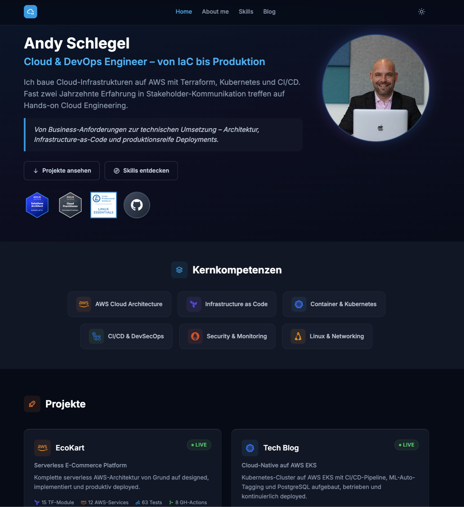
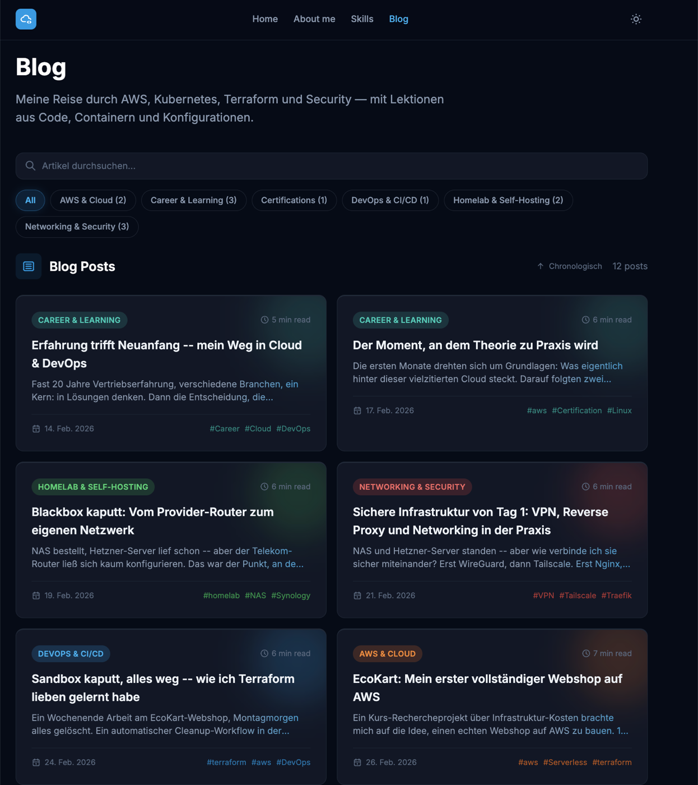
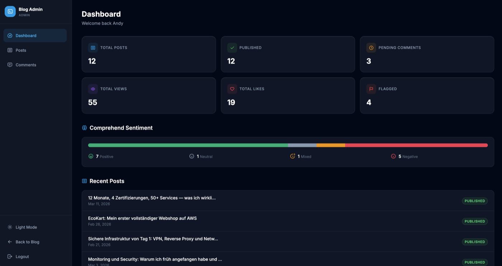
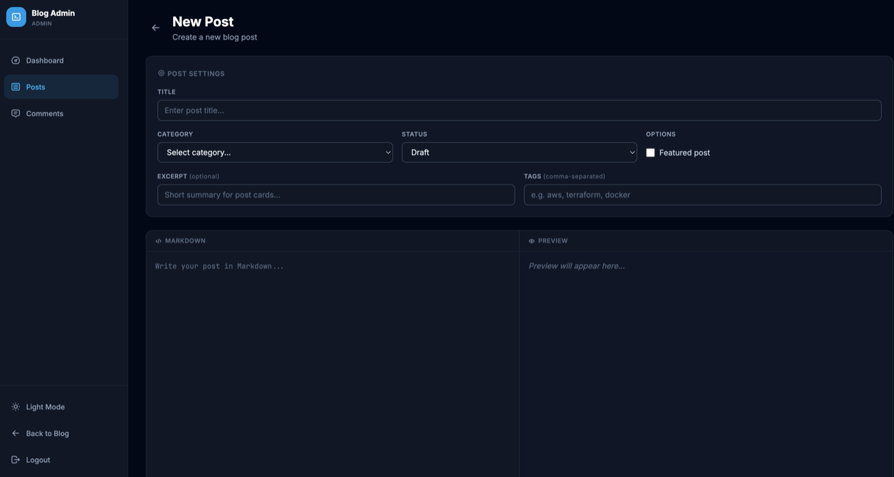
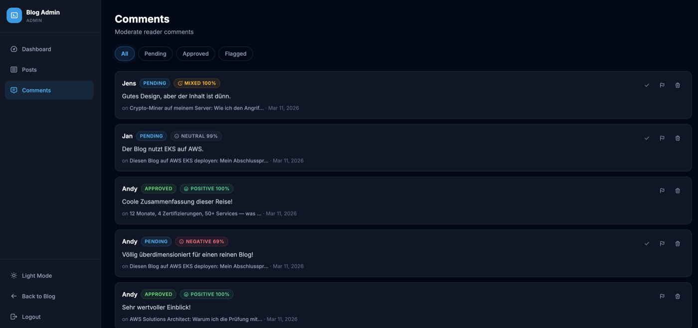
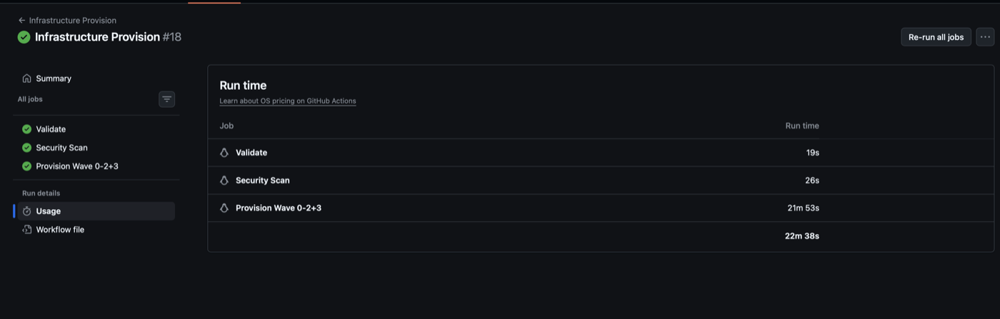
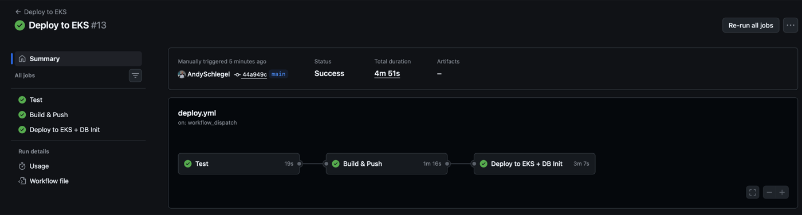
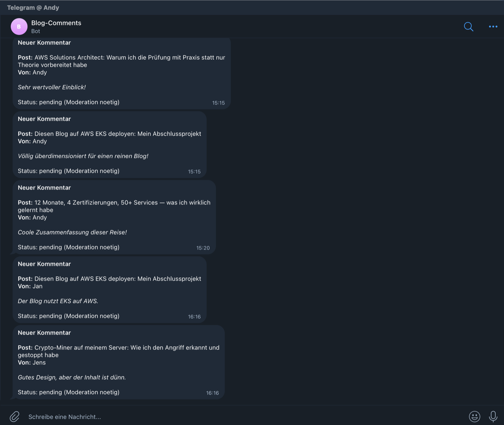

# My Personal Tech Blog

> **Cloud-native tech blog on AWS EKS -- built from scratch with Terraform, Kubernetes, and CI/CD. Final project for the CloudHelden cloud engineering course.**

[](https://aws.amazon.com/)
[](https://www.terraform.io/)
[](https://www.typescriptlang.org/)
[](https://github.com/AndySchlegel/my-personal-tech-blog/security)
[](LICENSE)

---

## Table of Contents

- [Overview](#overview)
- [Architecture](#architecture)
- [Tech Stack](#tech-stack)
- [Features](#features)
- [Infrastructure](#infrastructure)
- [Screenshots](#screenshots)
- [Security](#security)
- [Getting Started](#getting-started)
- [Deployment](#deployment)
- [Cost Analysis](#cost-analysis)
- [Lessons Learned](#lessons-learned)
- [Project Statistics](#project-statistics)
- [Author](#author)

---

## Overview

This blog tells a real story: starting with a Synology NAS and a basic router, building up to a hybrid infrastructure across 4 environments (NAS, Hetzner VPS, local dev, AWS), earning 4 certifications, and deploying production workloads on AWS EKS.

### Why This Project?

1. **Real portfolio piece** -- Documents an authentic learning journey with 12 German blog articles
2. **Monitoring-first mindset** -- A three-tier alerting stack (performance, availability, security) battle-tested in a real incident
3. **Multi-environment experience** -- From homelab to cloud, demonstrates hands-on infrastructure skills across NAS, VPS, and AWS
4. **EKS complements serverless** -- Together with a previous serverless project (EcoKart), covers both cloud paradigms
5. **Natural ML integration** -- Amazon Comprehend for auto-generated tags and comment sentiment analysis with auto-moderation
6. **Dual-track hosting** -- EKS for showcase demos, Lightsail ($5.50/month) for permanent hosting

---

## Architecture

```
Route 53 (DNS: blog.aws.his4irness23.de)
    |
CloudFront (CDN + TLS via ACM, PriceClass_100)
    |
    +-- S3 Origin (static assets, OAC-signed requests)
    +-- ALB Origin (dynamic content, added after EKS deploy)
    |
ALB (AWS Load Balancer Controller, managed via IRSA)
    |
EKS Cluster (eu-central-1, 2 AZs)
    |--- Frontend Pod (nginx + Tailwind CSS) -- HPA 1-3 replicas
    |--- Backend Pod (Express + TypeScript) -- HPA 1-4 replicas
    |
    +-- Private Subnets (10.0.10.0/24, 10.0.11.0/24)
    |       |--- EKS Nodes (Spot: t3.medium + t3a.medium)
    |       |--- RDS PostgreSQL 16 (db.t3.micro)
    |
    +-- Public Subnets (10.0.1.0/24, 10.0.2.0/24)
            |--- ALB
            |--- NAT Gateway (conditional)
    |
Cognito (Admin JWT authentication, IRSA)
    |
Amazon Comprehend (ML: auto-tags + sentiment, IRSA)
    |
Telegram Bot API (comment notifications)
```

---

## Tech Stack

| Component | Technology |
|-----------|-----------|
| Backend | Node.js, Express, TypeScript |
| Frontend | Tailwind CSS, Tabler Icons, Devicon, nginx |
| Database | PostgreSQL 16 (RDS) |
| Content | Markdown (stored in DB, rendered in frontend) |
| Auth | AWS Cognito (OAuth 2.0 code flow, Hosted UI) |
| ML | Amazon Comprehend (key phrase extraction + sentiment analysis) |
| CDN | CloudFront + S3 (OAC, static assets) |
| IaC | Terraform (9 modules, all from scratch) |
| CI/CD | GitHub Actions with OIDC (no long-lived AWS credentials) |
| Notifications | Telegram Bot API (native fetch, non-blocking) |
| Container | Podman (multi-stage builds), EKS (Spot instances) |
| Security | tfsec, Checkov, Trufflehog, ESLint, Husky |

---

## Features

### Public

- Blog posts with Markdown rendering and syntax highlighting
- Search and category filtering (debounced, server-side SQL)
- Auto-generated tags via Amazon Comprehend
- Comment system with sentiment analysis and Telegram notifications
- Like button with animated heart icon (localStorage deduplication)
- About page ("Sales DNA meets Cloud Architecture") with story sections, roadmap timeline, and quote blocks
- Skills page with badge labels (AWS CERTIFIED, PRODUKTIV, HANDS-ON, LIVE), Credly cert links, and project highlights
- Impressum, Datenschutz, and Haftungsausschluss (German legal pages)
- Dark mode (default) with light mode toggle
- Fully responsive (mobile-first)
- Scroll-reveal animations and hover effects on all interactive elements

### Admin Dashboard (Cognito-protected)

- Login via Cognito Hosted UI (OAuth 2.0 code flow) with dev mode bypass
- Dashboard overview with 6 stat cards (posts, published, pending, views, likes, flagged)
- Comprehend sentiment overview (visual bar + legend)
- Recent posts and comments activity feed
- Post management: create, edit, delete with side-by-side Markdown editor + live preview
- Comment moderation: approve, flag, delete with status filtering
- Auto-moderation: NEGATIVE comments (>= 70% confidence) get auto-flagged
- Telegram bot notifications for new comments
- Sidebar navigation with responsive mobile layout

---

## Infrastructure

### Terraform Modules (9 modules, all written from scratch)

| Module | Purpose | Key Resources |
|--------|---------|---------------|
| **VPC** | Network foundation | VPC, 2 public + 2 private subnets, IGW, conditional NAT GW |
| **Security Groups** | Layered firewall | ALB SG, EKS Node SG, RDS SG (defense in depth) |
| **ECR** | Container registry | 2 repos (frontend + backend), lifecycle policies |
| **S3** | Static assets | Assets bucket, versioning, encryption, CORS, all public access blocked |
| **Cognito** | Admin auth | User pool, OAuth code flow, app client, admin group |
| **GitHub OIDC** | CI/CD auth | OIDC provider, IAM role, 2 policies (deploy + terraform) |
| **RDS** | Database | PostgreSQL 16, db.t3.micro, private subnets, 7-day backups |
| **EKS** | Kubernetes | Cluster, spot node group, KMS encryption, OIDC/IRSA, add-ons |
| **CloudFront** | CDN | Distribution, ACM cert (us-east-1), OAC for S3, Route 53 DNS |

### Wave Deployment Strategy

Infrastructure is deployed in cost-controlled waves to avoid unnecessary charges:

| Wave | Resources | Monthly Cost | When |
|------|-----------|-------------|------|
| 0 | Bootstrap (S3 state + DynamoDB) | $0 | One-time setup |
| 1 | VPC, SGs, ECR, S3, Cognito, GitHub OIDC | ~$0.50 | Anytime |
| 2 | RDS | ~$13 (stoppable) | When DB needed |
| 3 | EKS + NAT GW + CloudFront | ~$126 | Sprint only |

After sprint: destroy Waves 2-3 -> back to ~$0.50/month.

---

## Screenshots

### Blog

| Homepage | Blog Post List |
|----------|---------------|
|  |  |

### Admin Dashboard

| Dashboard with Comprehend Sentiment | Markdown Post Editor |
|-------------------------------------|---------------------|
|  |  |

| Comment Moderation with Sentiment Badges |
|------------------------------------------|
|  |

### CI/CD Pipelines

| Infrastructure Provision | Deploy to EKS |
|-------------------------|---------------|
|  |  |

### Telegram Notifications

| Real-time Comment Alerts |
|--------------------------|
|  |

---

## Security

### DevSecOps Pipeline

Automated security scanning on every push -- set up before the first line of application code.

| Tool | What it does | Runs on |
|------|-------------|---------|
| **tfsec** | Scans Terraform for security misconfigurations | Push/PR to main/develop + Terraform pipeline validate |
| **Checkov** | Validates AWS infrastructure against best practices | Push/PR to main/develop + Terraform pipeline validate |
| **Trufflehog** | Detects accidentally committed secrets | Push/PR to main/develop |
| **ESLint** | Catches code errors and bad patterns | Push to main/develop (when backend/ changes) |
| **Prettier** | Enforces consistent code formatting | Push to main/develop (when backend/ changes) |
| **Husky** | Pre-commit hooks -- blocks bad commits locally | Before every commit |

All security findings are uploaded to the GitHub Security tab via SARIF format.

### Infrastructure Security

- All S3 public access blocked (CloudFront OAC only)
- RDS in private subnets, accessible only from EKS nodes (SG-to-SG rules)
- EKS secrets encrypted at rest via KMS
- IRSA for pod-level IAM (least privilege: backend for Comprehend, ALB Controller for load balancing)
- TLS 1.2+ enforced on CloudFront
- Cognito with strong password policy
- No AWS credentials in CI/CD (OIDC federation)

---

## Getting Started

### Prerequisites

- **Node.js** 22.x
- **Podman** (for containerized development)
- **Terraform** 1.9+ (for infrastructure)
- **AWS CLI** v2 (configured with credentials)

### Local Development

```bash
# Option 1: Podman Compose (recommended - runs everything)
podman machine start
podman-compose up --build

# Frontend:        http://localhost:8080
# Admin Dashboard: http://localhost:8080/admin/login.html
# Backend API:     http://localhost:3000/api
# PostgreSQL:      localhost:5432

# Option 2: Frontend only (just open in browser)
open frontend/src/index.html
# Shows demo posts when backend is not running

# Option 3: Backend only
cd backend
npm install
npm run dev
```

---

## Deployment

### Terraform Setup

```bash
# 1. Bootstrap remote state (one-time)
chmod +x terraform/bootstrap-state.sh
./terraform/bootstrap-state.sh

# 2. Initialize Terraform
cd terraform
terraform init

# 3. Deploy in waves
# Wave 1: Free/cheap resources
terraform apply -target=module.vpc -target=module.security_groups \
  -target=module.ecr -target=module.s3 -target=module.cognito \
  -target=module.github_oidc

# Wave 2: Database (~$13/month)
terraform apply -target=module.rds

# Wave 3: Kubernetes + CDN (~$126/month)
# First: set enable_nat_gateway = true in terraform.tfvars
terraform apply
```

### CI/CD Pipelines

Five workflows, all using OIDC federation (no long-lived AWS credentials):

**Deploy workflow** (`deploy.yml` -- manual trigger):

```
Manual Trigger (GitHub UI "Run workflow")
    |
    Job 1: TEST (skippable for hotfixes)
    +-- ESLint + Prettier + Jest unit tests (31 tests)
    |
    Job 2: BUILD
    +-- OIDC auth (short-lived AWS credentials)
    +-- Build Docker images (backend + frontend)
    +-- Push to ECR (tagged: sha-<hash> + latest)
    |
    Job 3: DEPLOY
    +-- OIDC auth
    +-- Read infra values from Terraform state (fully dynamic, no manual secrets)
    +-- Install metrics-server + ALB Controller (Helm)
    +-- kubectl apply K8s manifests (10 files)
    +-- Create secrets, update images, apply ingress
    +-- Wait for rollout + print status
```

**Infrastructure Provision** (`infra-provision.yml` -- manual trigger):

```
Manual Trigger (optional: include Wave 3 checkbox)
    |
    Job 1: VALIDATE -> Job 2: SECURITY SCAN -> Job 3: PROVISION
    +-- Wave 0: IAM policies (ensures permissions are current)
    +-- Wave 1: VPC, SGs, ECR, S3, Cognito, OIDC
    +-- Wave 2: RDS
    +-- Wave 3: EKS + CloudFront + NAT GW (checkbox)
```

**Infrastructure Teardown** (`infra-destroy.yml` -- manual trigger):

```
Manual Trigger (type "DESTROY" to confirm)
    +-- Clean up ALB Controller resources (prevents orphaned ALBs)
    +-- Destroy Wave 3 -> Wave 2 -> Wave 1
    +-- OIDC excluded (keeps pipeline auth alive)
    +-- Verify: only OIDC resources remain in state
```

**Terraform workflow** (`terraform.yml`) and **Security scanning** (`security-scan.yml`) provide granular wave control and automatic PR security gates respectively.

Only 2 GitHub Secrets required for the entire lifecycle: `AWS_ROLE_ARN` + `DB_PASSWORD`.

---

## Cost Analysis

| Service | Monthly Cost | Notes |
|---------|-------------|-------|
| EKS Control Plane | ~$73 | Destroy after sprint |
| EKS Nodes (2x spot) | ~$19 | Spot = 70% savings |
| NAT Gateway | ~$35 | Conditional, off in Wave 1-2 |
| RDS db.t3.micro | ~$13 | Stop when not needed (up to 7 days) |
| CloudFront | ~$1-5 | Based on traffic |
| Route 53 | ~$0.50 | Hosted zone |
| S3 | ~$0.05 | Static assets |
| Cognito | Free | <50K MAUs |
| KMS | ~$1 | EKS secrets key |
| **Full deployment** | **~$143** | **All services running** |
| **After sprint** | **~$0.50** | **Only Route 53 + S3** |

**EKS Strategy:** Deploy for sprints (~$4.20 for 8 hours of EKS), destroy after. Full lifecycle (provision -> deploy -> destroy) takes ~25 minutes and is 100% reproducible.

### Dual-Track Hosting

| Track | Purpose | Monthly Cost | Infrastructure |
|-------|---------|-------------|----------------|
| **EKS** | Showcase for demos and interviews | ~$143 (sprint only) | Full AWS stack (EKS, RDS, ALB, CloudFront) at `blog.aws.his4irness23.de` |
| **Lightsail** | Permanent hosting | ~$5.50 | Single instance, PostgreSQL on-instance, Let's Encrypt SSL at `blog.his4irness23.de` |

Same codebase, separate deployment configs. EKS demonstrates Kubernetes expertise, Lightsail keeps the blog online permanently at minimal cost. Cognito and Comprehend stay as managed AWS services on both tracks.

---

## Lessons Learned

Documented continuously in [LESSONS_LEARNED.md](LESSONS_LEARNED.md) -- 35 lessons and counting.

Key highlights:

- **#1** Security scanning from day 1 costs nothing but catches issues early
- **#4** Separate app from server for testability (Express pattern)
- **#10** Write IaC first, deploy later -- iterate for free
- **#17** Deploy pipeline reads infra values from Terraform state -- no manual secret updates after destroy+apply
- **#21** Circular dependency deadlock -- self-referential IAM module fixed with `lifecycle { ignore_changes }` + Wave 0
- **#26** ALB Controller creates resources outside Terraform -- must clean up before EKS destroy
- **#30** Full lifecycle reproducibility verified -- provision, deploy, destroy, repeat
- **#32** Dual-track hosting: EKS for showcase, Lightsail for permanent
- **#35** Amazon Comprehend misclassifies German sarcasm -- manual moderation still required

---

## Project Statistics

| Metric | Value |
|--------|-------|
| Development Duration | 5 weeks (Feb-Mar 2026) |
| Terraform Modules | 9 in this project (25+ across all projects) |
| AWS Services | 12 (VPC, EKS, RDS, S3, CloudFront, Cognito, ECR, Route 53, KMS, Comprehend, ALB, IAM) |
| Blog Articles | 11 (German, real content) + 1 added live as proof-of-concept |
| Categories | 7 (each with unique color system) |
| Tags | 32 |
| Unit Tests | 31 (health, posts, comments, categories, auth) |
| K8s Manifests | 11 (namespace, config, secrets, services, deployments, ingress, HPA, db-init) |
| CI/CD Workflows | 5 (deploy, provision, destroy, terraform, security-scan) |
| Commits | 113+ |
| Lessons Learned | 35 documented |

---

## Author

**Andy Schlegel**
Cloud & DevOps Engineer

- GitHub: [@AndySchlegel](https://github.com/AndySchlegel)

---

**Project Status:** Feature-complete. EKS showcase stack fully operational, Lightsail permanent hosting planned.
**Last Updated:** 2026-03-12
**AWS Region:** eu-central-1 (Frankfurt)
